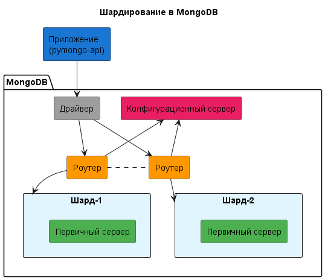
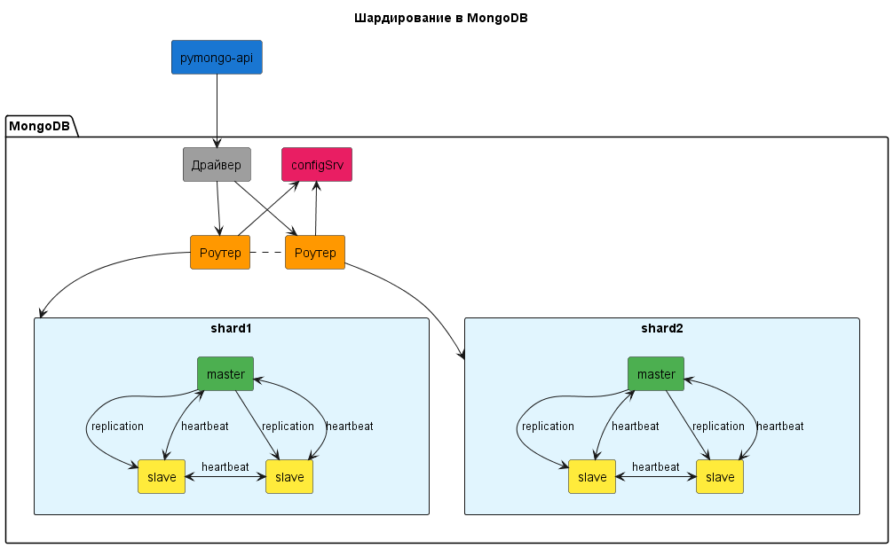
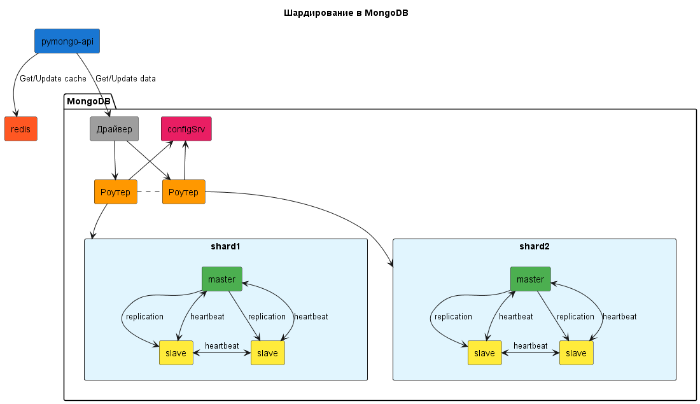

# Задание 1. Планирование

## Первый вариант схемы

Изобразите, как вы будете использовать шардирование в MongoDB, чтобы повысить производительность. Двух шардов будет достаточно.

## Второй вариант схемы

Изобразите, как будет реализована репликация MongoDB для повышения отказоустойчивости. На этом этапе у каждого шарда должно быть по три реплики.

## Третий вариант схемы

Изобразите вашу реализацию кеширования, чтобы повысить производительность ещё больше. Добавьте инстанс Redis для кеширования запросов приложения к MongoDB.

# Задание 2. Шардирование

По пути `Task2`
