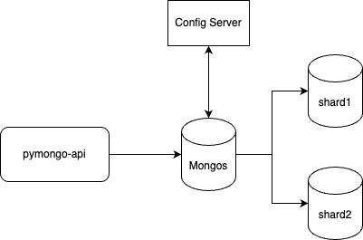
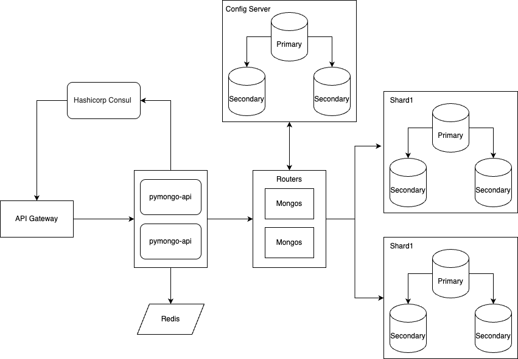
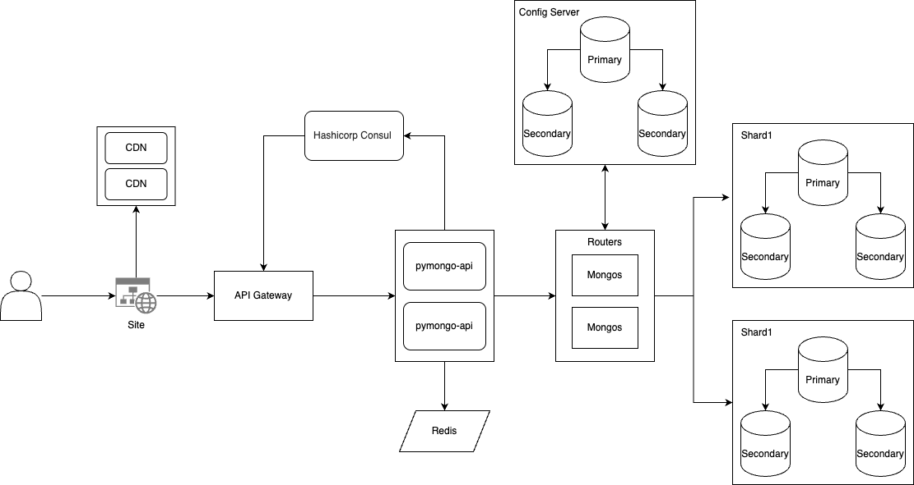

## Как запустить

Чтобы проверить финальный вариант приложения, перейдите в папку `sharding-repl-cache` 
и следуйте инструкциям в файле [README.md](./sharding-repl-cache/README.md)

```shell
cd sharding-repl-cache
cat ./README.md
```


# Схемы

## Задание 1


## Задание 5


## Задание 6

