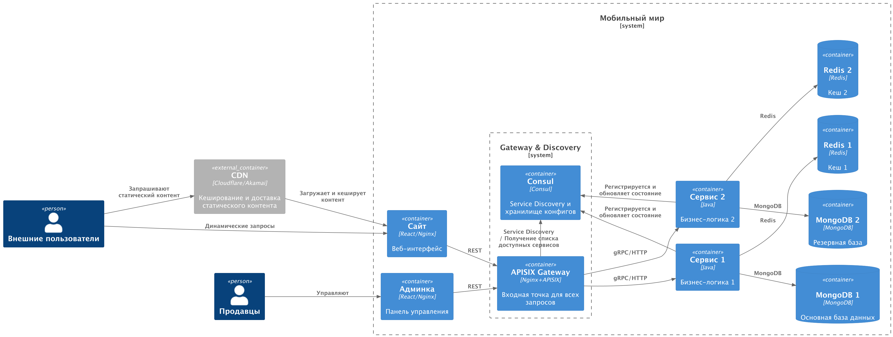

# 🛒 Highload-архитектура "Черная пятница"

Проект представляет собой реализацию высоконагруженной архитектуры для обработки запросов в период распродажи "Черная пятница".

## 📁 Структура проекта

- **Задание 1 (Базовая архитектура):**  
  Реализовано и отражено на схеме — `diagramm/black-friday-diagramm.puml`

- **Задание 2 (Шардирование MongoDB):**  
  Реализовано в директории `mongo-sharding/`

- **Задание 3 (Шардирование с репликацией):**  
  Реализовано в директории `mongo-sharding-repl/`

- **Задание 4 (Шардирование + репликация + кеширование):**  
  Реализовано в директории `sharding-repl-cache/`  
  Архитектура отражена на схеме

- **Задание 5 (Добавление CDN):**  
  Реализовано и отражено на финальной схеме

## 🧱 Диаграмма архитектуры

Диаграмма отражает полную архитектуру системы, включая:

- Балансировку нагрузки через Gateway
- Шардирование и репликацию MongoDB для горизонтального масштабирования
- Использование Redis для кеширования данных
- CDN для ускорения доставки статического контента
