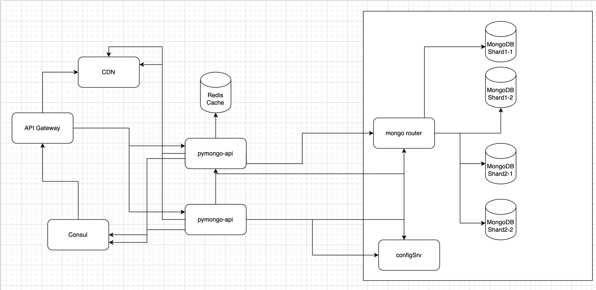

###1 
Сделано

###2
Зайти в папку mongo-sharding и выполнить команды из README

###3 
Зайти в папку mongo-sharding-repl и выполнить команды из README

###4
Зайти в папку sharding-repl-cache и выполнить команды из README

###5 
Сделано

###6
