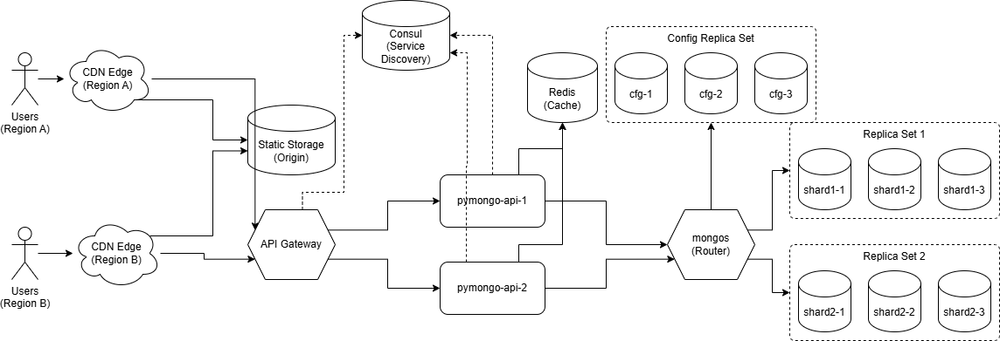

# Проектная работа: "Подготовка к Чёрной пятнице"

## Архитектура

В ходе проекта была спроектирована и реализована отказоустойчивая и масштабируемая архитектура для онлайн-магазина. Эволюция архитектурных решений отражена в следующих диаграммах:

- **[task1.1.drawio](task1.1.drawio)**: Начальный этап. Внедрение **шардирования** (Sharding) для горизонтального масштабирования базы данных MongoDB.
- **[task1.2.drawio](task1.2.drawio)**: Повышение отказоустойчивости. Добавление **репликации** (Replication) для каждого шарда и для конфигурационных серверов.
- **[task1.3.drawio](task1.3.drawio)**: Оптимизация производительности. Внедрение **кеширования** (Caching) на базе Redis для разгрузки БД.
- **[task1.4.drawio](task1.4.drawio)**: Масштабирование приложения. Добавление **API Gateway** для балансировки нагрузки и **Consul** для обнаружения сервисов (Service Discovery).
- **[task1.5.drawio](task1.5.drawio)**: Финальная архитектура. Добавление **CDN** для ускорения доставки статического контента пользователям из разных регионов.


## Запуск и проверка

Финальная версия проекта, включающая шардирование, репликацию и кеширование, находится в директории `sharding-repl-cache`.

### 1. Перейдите в директорию и запустите Docker Compose

```bash
cd sharding-repl-cache
docker compose up -d
```

### 2. Инициализация кластера

**Важно:** После запуска контейнеров подождите 15-20 секунд, чтобы все сервисы успели запуститься. Затем выполните следующие команды по очереди, делая небольшие паузы (3-5 секунд) между ними для выбора лидеров в Replica Sets.

**Инициализация конфигурационного сервера:**
```bash
docker compose exec -T configSrv1 mongosh --port 27017 --quiet <<EOF
rs.initiate({
  _id : "config_server",
  configsvr: true,
  members: [
    { _id : 0, host : "configSrv1:27017" },
    { _id : 1, host : "configSrv2:27017" },
    { _id : 2, host : "configSrv3:27017" }
  ]
});
EOF
```

**Инициализация шардов:**
```bash
docker compose exec -T shard1-1 mongosh --port 27018 --quiet <<EOF
rs.initiate({
  _id : "shard1",
  members: [
    { _id : 0, host : "shard1-1:27018" },
    { _id : 1, host : "shard1-2:27018" },
    { _id : 2, host : "shard1-3:27018" }
  ]
});
EOF
```
```bash
docker compose exec -T shard2-1 mongosh --port 27019 --quiet <<EOF
rs.initiate({
  _id : "shard2",
  members: [
    { _id : 0, host : "shard2-1:27019" },
    { _id : 1, host : "shard2-2:27019" },
    { _id : 2, host : "shard2-3:27019" }
  ]
});
EOF
```

**Настройка роутера и наполнение базы:**
```bash
docker compose exec -T mongos_router mongosh --port 27020 --quiet <<EOF
sh.addShard("shard1/shard1-1:27018,shard1-2:27018,shard1-3:27018");
sh.addShard("shard2/shard2-1:27019,shard2-2:27019,shard2-3:27019");

sh.enableSharding("somedb");
sh.shardCollection("somedb.helloDoc", { "name" : "hashed" });

use somedb;
for(var i = 0; i < 1000; i++) db.helloDoc.insertOne({age:i, name:"ly"+i});
EOF
```

### 3. Проверка результата

1.  **Проверка статуса кластера:**
    Откройте в браузере `http://localhost:8080/`. Вы должны увидеть JSON, подтверждающий, что `cache_enabled` равен `true`, а в секции `shards` для каждого шарда указано по 3 реплики.

2.  **Проверка кеширования:**
    Откройте `http://localhost:8080/helloDoc/users`. Первый запрос может занять некоторое время. Все последующие обновления страницы (F5) должны выполняться мгновенно (< 100мс), так как данные будут отдаваться из кеша Redis.