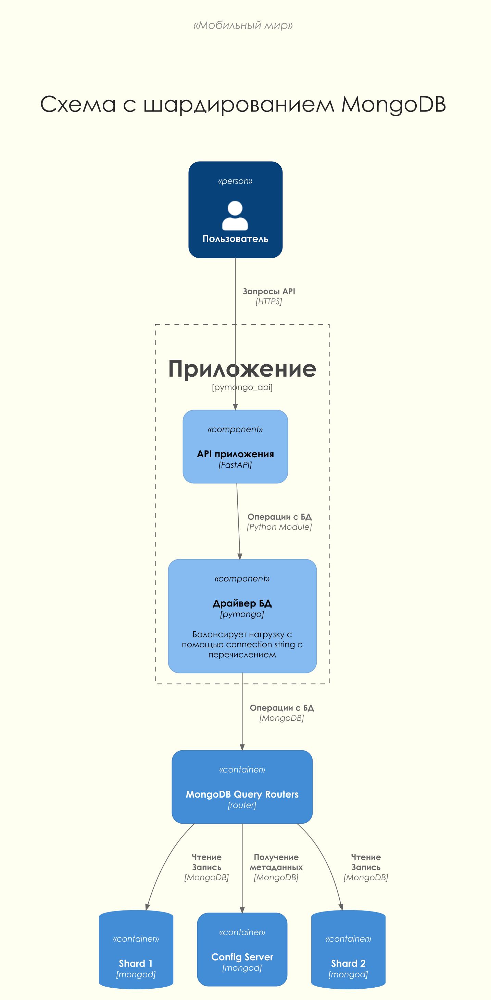
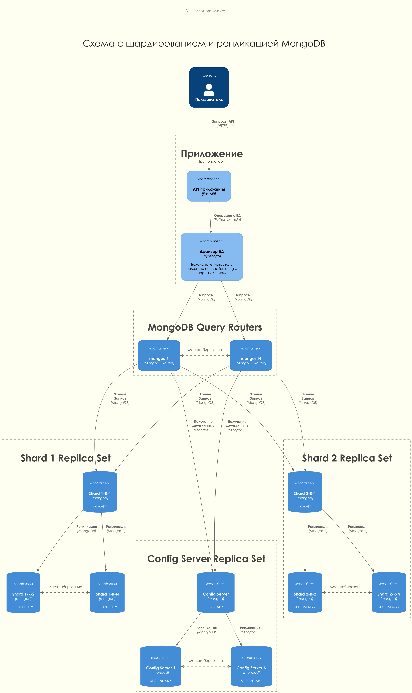
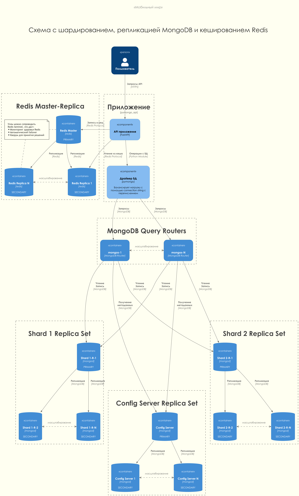
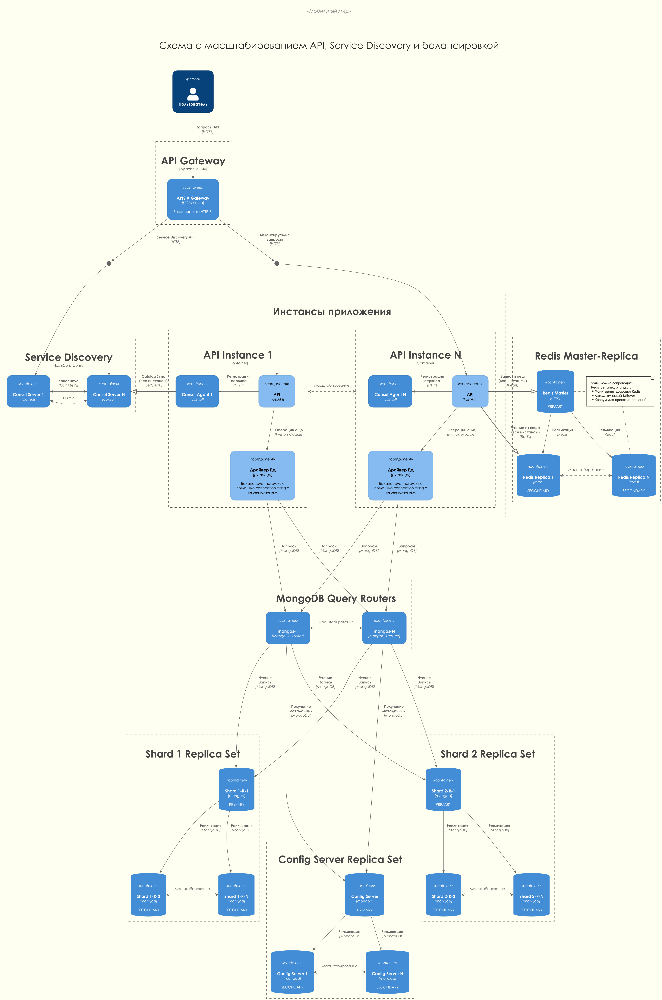
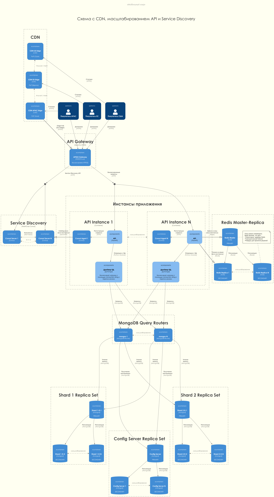

# Ревью заданий

Для повышения удобства ревью основное приложение и решения заданий 2, 3, 4 покрыты тестами.
Тесты находятся в директории `api_app_test` каждой копии приложения.
Запуск тестов описан в инструкции по запуску к каждому приложению.

Для повышения качества кода весь проект проверяется линтером ruff.
Инструкция по запуску находится в основном [README.md](../README.md)

# Задание 1. Планирование

Разработаны пять последовательных вариантов архитектурных схем, отражающих эволюцию решения от изначального стенда до финальной инфраструктуры с Service Discovery, балансировкой и CDN:

- [planning_1_sharding.png](c4/deployment/planning_1_sharding.png) - схема шардирования MongoDB.
- [planning_2_replication.png](c4/deployment/planning_2_replication.png) - добавлена репликация шардов.
- [planning_3_caching.png](c4/deployment/planning_3_caching.png) - подключён Redis для кеширования.

Схемы 4 и 5 представлены в последних заданиях.

# Задание 2. Шардирование

Создан проект [mongo_sharding](../mongo_sharding/), реализующий кластер MongoDB с двумя шардами:

- [adr.md](../mongo_sharding/adr.md) - выбор метода шардирования
- [README.md](../mongo_sharding/README.md) - инструкции по запуску
- [compose.yaml](../mongo_sharding/compose.yaml) - стек контейнеров
- [mongo-init.sh](../mongo_sharding/mongo-init.sh) - инициализация кластера
- [api_app_test](../mongo_sharding/api_app_test/app_test.py) - тесты, подтверждающие выполнение задания

# Задание 3. Репликация

Проект [mongo_sharding_repl](../mongo_sharding_repl/) расширяет шардирование репликацией каждого компонента:

- [README.md](../mongo_sharding_repl/README.md) - инструкции по запуску
- [compose.yaml](../mongo_sharding_repl/compose.yaml) - стек контейнеров
- [mongo-init.sh](../mongo_sharding_repl/mongo-init.sh) - инициализация кластера
- [api_app_test](../mongo_sharding_repl/api_app_test/app_test.py) - тесты, подтверждающие выполнение задания

# Задание 4. Кеширование

Проект [sharding_repl_cache](../sharding_repl_cache/) добавляет Redis для кеширования ответов:

- [adr.md](../sharding_repl_cache/caching.md) - выбор метода кеширования
- [README.md](../sharding_repl_cache/README.md) - инструкции по запуску
- [compose.yaml](../sharding_repl_cache/compose.yaml) - стек контейнеров
- [mongo-init.sh](../sharding_repl_cache/mongo-init.sh) - инициализация кластера
- [api_app_test](../sharding_repl_cache/api_app_test/app_test.py) - тесты, подтверждающие выполнение задания

# Задание 5. Service Discovery и балансировка

На основе кеширующего решения добавлены Consul и API Gateway (APISIX) с несколькими инстансами приложения.

# Задание 6. CDN

 [Финальный вариант схемы](c4/deployment/planning_5_service-discovery-balancing-cdn.png) демонстрирует подключение CDN для пользователей из разных регионов. CDN кэширует статический контент и взаимодействует с API Gateway.

