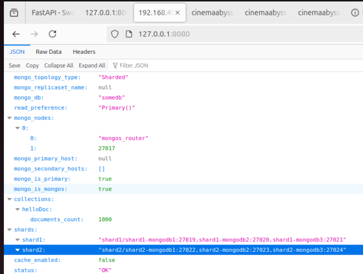
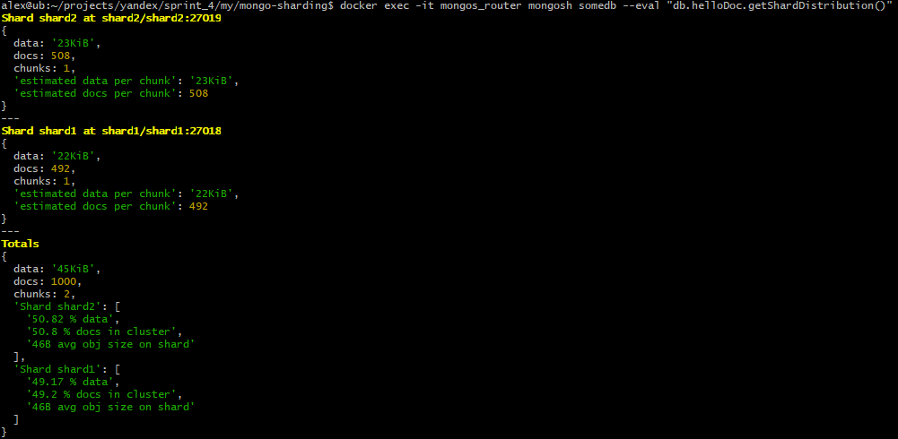
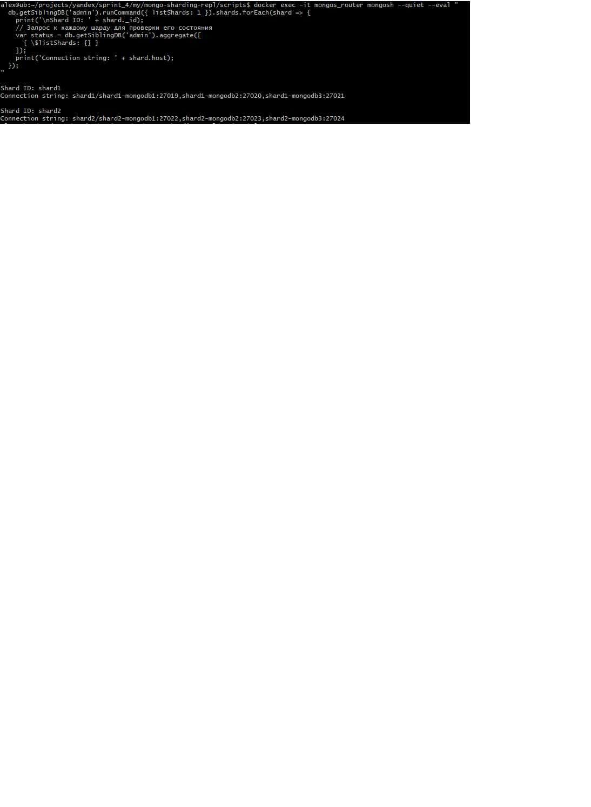

# pymongo-api


## Как запустить

Запускаем mongodb и приложение

```shell
docker compose up -d
```

Заполняем mongodb данными и инициализируем роутер и конфиг

```shell
./scripts/mongo-init.sh
```

## Как проверить через pymongo-api:

Откройте в браузере http://localhost:8080 - данные о MongoDB  
  

Откройте в браузере http://localhost:8080/helloDoc/count - колличество записей в базе

## Проверка внутри контейнеров средствами mongosh:

# Проверить распределение по шардам:
```shell
docker compose exec -T shard1 mongosh --port 27018 --quiet  
shard1 [direct: primary] somed> use somedb  
switched to db somedb  
shard1 [direct: primary] somedb> db.helloDoc.countDocuments()  
492  
  
docker compose exec -T shard2 mongosh --port 27019 --quiet  
shard2 [direct: primary] test> use somedb  
switched to db somedb  
shard2 [direct: primary] somedb> db.helloDoc.countDocuments()  
508  
```  


# Проверить состояние шардов через коллекцию
```shell
docker exec -it mongos_router mongosh somedb --eval "db.helloDoc.getShardDistribution()"  
```  

Данные с MongoDB - распределение коллекции по шардам:    

  

# Проверить репликации для шардов
```shell
docker exec -it mongos_router mongosh --quiet --eval "
  db.getSiblingDB('admin').runCommand({ listShards: 1 }).shards.forEach(shard => {
    print('\nShard ID: ' + shard._id);
    // Запрос к каждому шарду для проверки его состояния
    var status = db.getSiblingDB('admin').aggregate([
      { \$listShards: {} }
    ]); 
    print('Connection string: ' + shard.host);
  });
"
```  

Отображение шардирования средствами MongoDB:  
    

