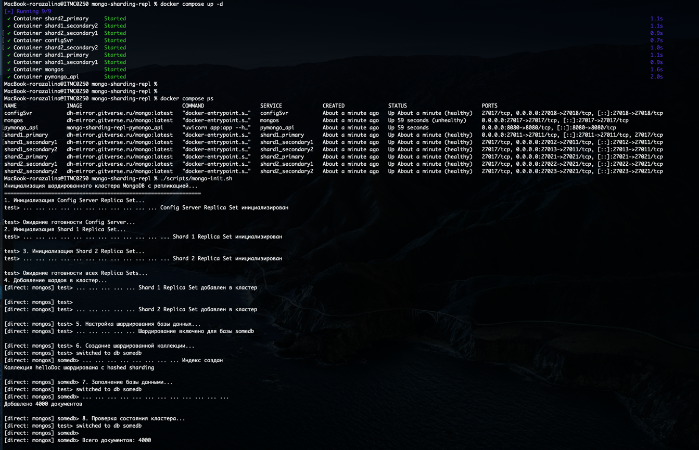
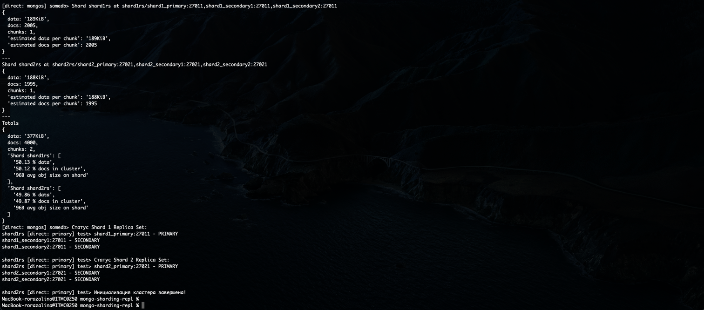
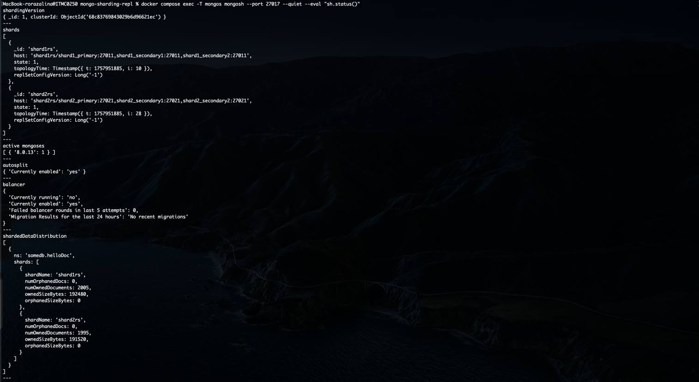
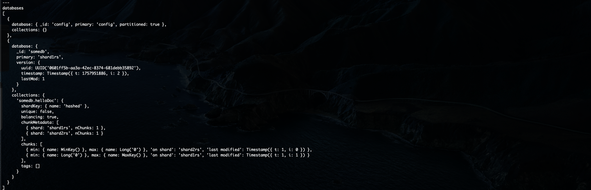
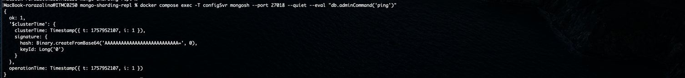
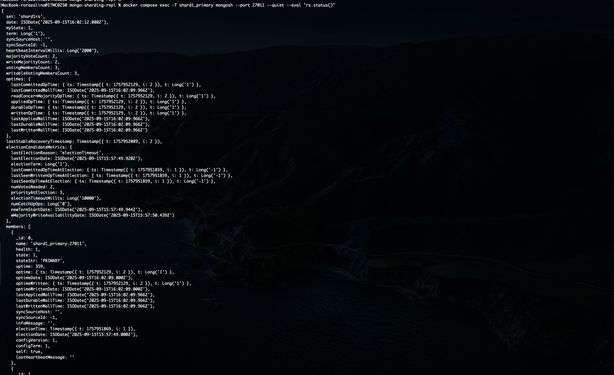
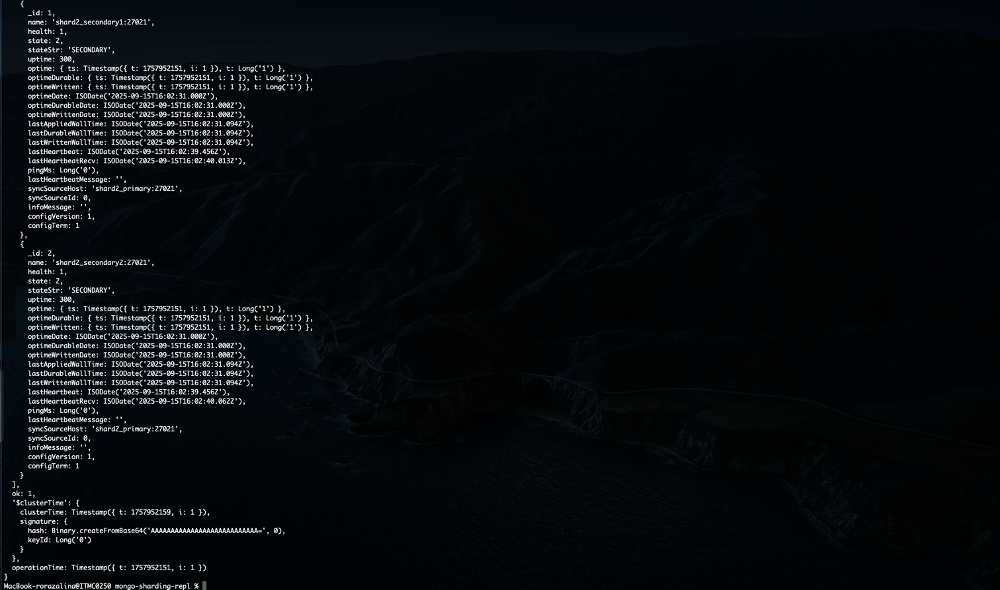
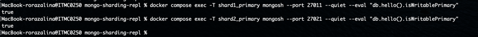
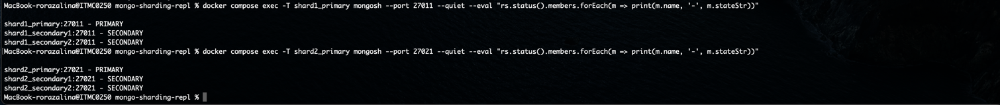

# MongoDB Sharded Cluster с Репликацией
## Архитектура

---

### Компоненты кластера:

1. **Config Server Replica Set**
   - `configsvr:27018` - хранит метаданные кластера

2. **Shard 1 Replica Set**
   - `shard1_primary:27011` (Primary, приоритет 3)
   - `shard1_secondary1:27012` (Secondary, приоритет 2)
   - `shard1_secondary2:27013` (Secondary, приоритет 1)

3. **Shard 2 Replica Set**
   - `shard2_primary:27021` (Primary, приоритет 3)
   - `shard2_secondary1:27022` (Secondary, приоритет 2)
   - `shard2_secondary2:27023` (Secondary, приоритет 1)

4. **MongoDB Router** (mongos)
   - `mongos:27017` - точка входа для клиентских приложений

5. **API Application**
   - `pymongo_api:8080` - веб-приложение

---

### 1. Запуск кластера

Сначала поднимаем все сервисы:
```bash
docker compose up -d
```

Проверяем статус контейнеров:
```bash
docker compose ps
```

### 2. Инициализация репликации и шардирования

Для автоматической настройки кластера запускаем скрипт:
```bash
./scripts/mongo-init.sh
```




Он делает следующее:

1. **Проверка Config Server**
   - Убедимся, что config server готов принимать команды

2. **Инициализация Shard 1 Replica Set** 
   - Создание replica set с указанными приоритетами
   - Назначение primary узла

3. **Инициализация Shard 2 Replica Set**
   - То же самое, что и для Shard 1
   - Настройка отказоустойчивости

4. **Добавление шардов в кластер**
   - Регистрация replica sets в mongos
   - Настройка маршрутизации

5. **Создание шардированной коллекции**
   - Включение шардирования для базы **_somedb_**
   - Создание коллекции _**helloDoc**_ с hashed sharding по полю **_name_**

6. **Наполнение тестовыми данными**
   - Добавление 4000 документов
   - Данные автоматически распределяются по шардам

7. **Проверка состояния кластера**
   - Вывод статуса всех replica sets
   - Отображение распределения документов между шардовыми узлами

---

### 3. Проверка работы

#### 3.1. Веб-интерфейс
- Локально: http://localhost:8080
- На виртуальной машине: http://<ip_машины>:8080

#### Swagger-документация
- http://localhost:8080/docs

---
### 3.2. Через консоль

#### Общий статус шардированного кластера:
```bash
docker compose exec -T mongos mongosh --port 27017 --quiet --eval "sh.status()"
````



#### Проверка доступности Config Server:
```bash
docker compose exec -T configSvr mongosh --port 27018 --quiet --eval "db.adminCommand('ping')"
```


#### Статус Shard 1 Replica Set  
```bash
docker compose exec -T shard1_primary mongosh --port 27011 --quiet --eval "rs.status()"
```



#### Статус Shard 2 Replica Set (скрин аналогично как в Shard 1 Replica Set)
```bash
docker compose exec -T shard2_primary mongosh --port 27021 --quiet --eval "rs.status()"
```

#### Проверка Primary/Secondary узлов
```bash
docker compose exec -T shard1_primary mongosh --port 27011 --quiet --eval "db.hello().isWritablePrimary"  
docker compose exec -T shard2_primary mongosh --port 27021 --quiet --eval "db.hello().isWritablePrimary"
```


или
```bash
docker compose exec -T shard1_primary mongosh --port 27011 --quiet --eval "rs.status().members.forEach(m => print(m.name, '-', m.stateStr))"
```
