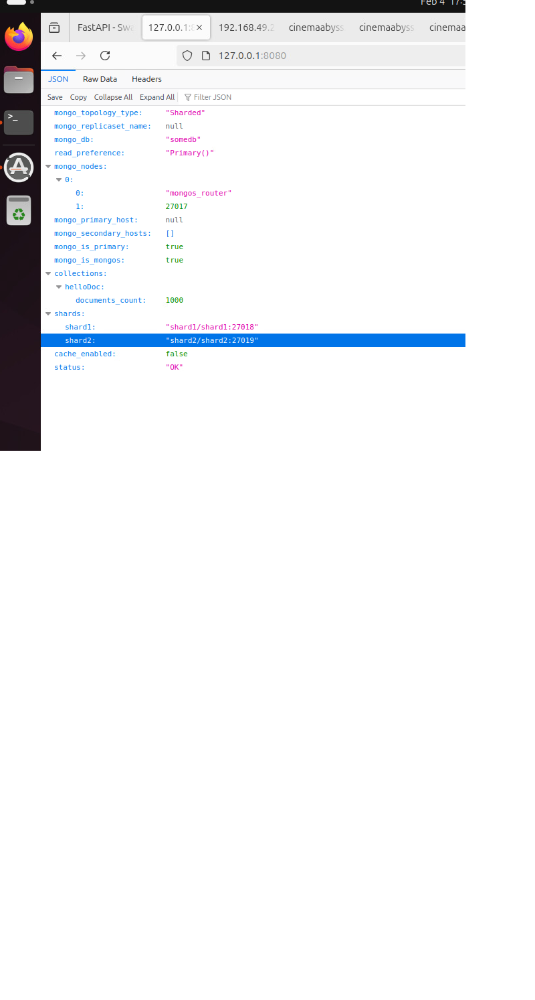
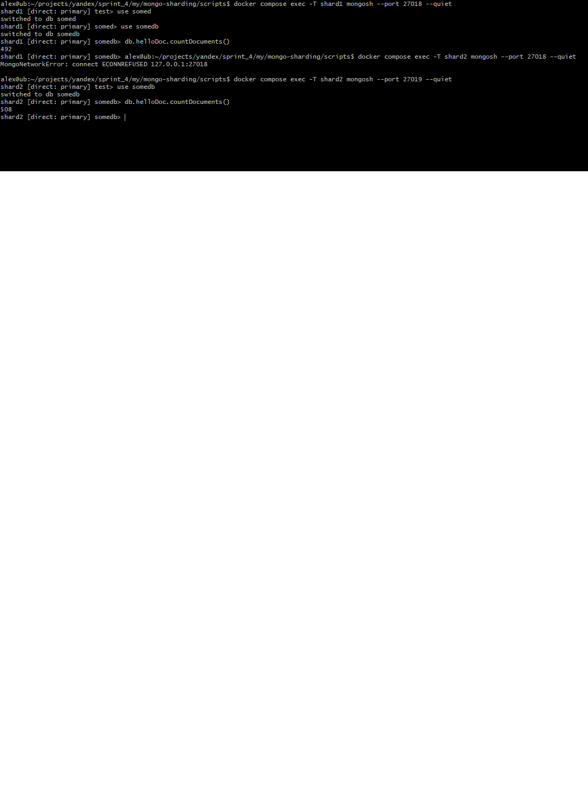
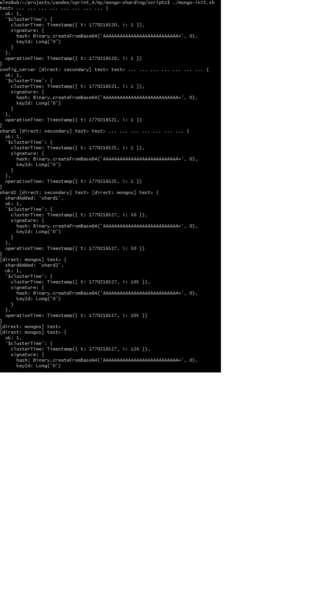

# pymongo-api

## Как запустить

Запускаем mongodb и приложение

```shell
docker compose up -d
```

Заполняем mongodb данными и инициализируем роутер и конфиг

```shell
./scripts/mongo-init.sh
```

## Как проверить через pymongo-api:

Откройте в браузере http://localhost:8080 - данные о MongoDB  
  

Откройте в браузере http://localhost:8080/helloDoc/count - количество записей в базе  

## Проверка внутри контейнеров средствами mongosh:
```shell
docker compose exec -T shard1 mongosh --port 27018 --quiet  
shard1 [direct: primary] somed> use somedb  
switched to db somedb  
shard1 [direct: primary] somedb> db.helloDoc.countDocuments()  
492  
  
docker compose exec -T shard2 mongosh --port 27019 --quiet  
shard2 [direct: primary] test> use somedb  
switched to db somedb  
shard2 [direct: primary] somedb> db.helloDoc.countDocuments()  
508  
```  

  
```shell
docker exec -it mongos_router mongosh somedb --eval "db.helloDoc.getShardDistribution()"  
```  
  

  

