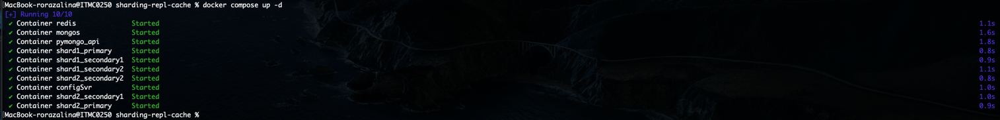
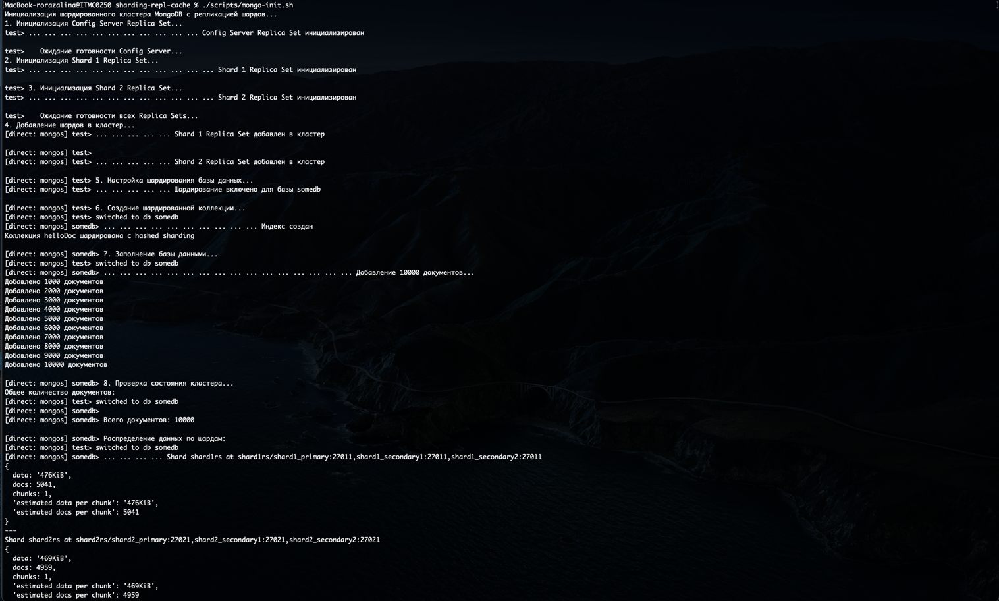
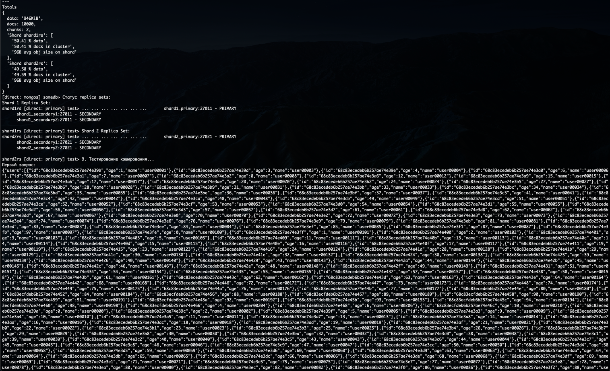
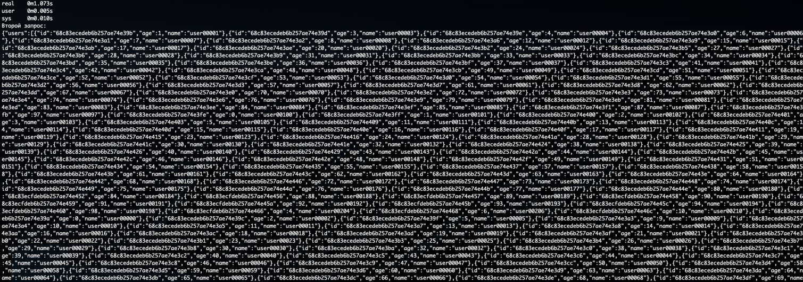
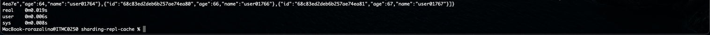
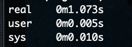
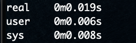

# MongoDB Sharded Cluster с Репликацией и Кешированием
## Архитектура

---

### Компоненты кластера:

1. **Config Server Replica Set**
   - `configsvr:27018` - хранит метаданные кластера

2. **Shard 1 Replica Set**
   - `shard1_primary:27011` (Primary, приоритет 3)
   - `shard1_secondary1:27012` (Secondary, приоритет 2)
   - `shard1_secondary2:27013` (Secondary, приоритет 1)

3. **Shard 2 Replica Set**
   - `shard2_primary:27021` (Primary, приоритет 3)
   - `shard2_secondary1:27022` (Secondary, приоритет 2)
   - `shard2_secondary2:27023` (Secondary, приоритет 1)

4. **MongoDB Router** (mongos)
   - `mongos:27017` - точка входа для клиентских приложений

5. **Redis Cache**
   - `redis:6379` - кеширования

6. **API Application**
   - `pymongo_api:8080` - веб-приложение

---

### 1. Запуск кластера

Сначала поднимаем все сервисы:
```bash
docker compose up -d
```

Проверяем статус контейнеров:
```bash
docker compose ps
```

---

### 2. Инициализация

Для автоматической настройки кластера запускаем скрипт:
```bash
./scripts/mongo-init.sh
```




---

### 3. Проверка работы

Веб-интерфейс
- Локально: http://localhost:8080
- На виртуальной машине: http://<ip_машины>:8080

#### Swagger-документация
- http://localhost:8080/docs

---
#### Тестирование через консоль
```bash
# первый запрос медленный
time curl -s http://localhost:8080/helloDoc/users | head -50


# второй запрос быстрый, так как читает из кэша
time curl -s http://localhost:8080/helloDoc/users | head -50
```

