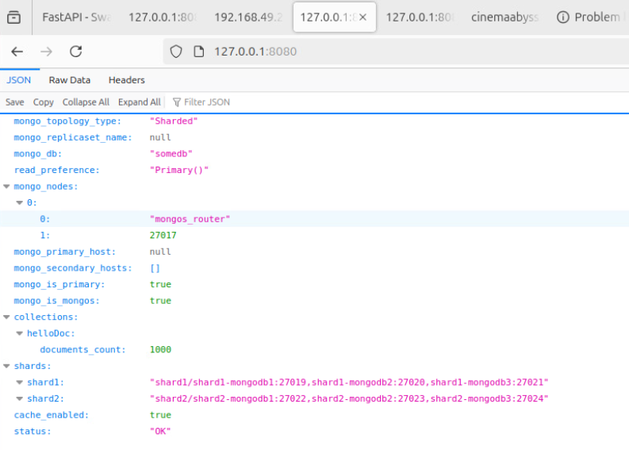
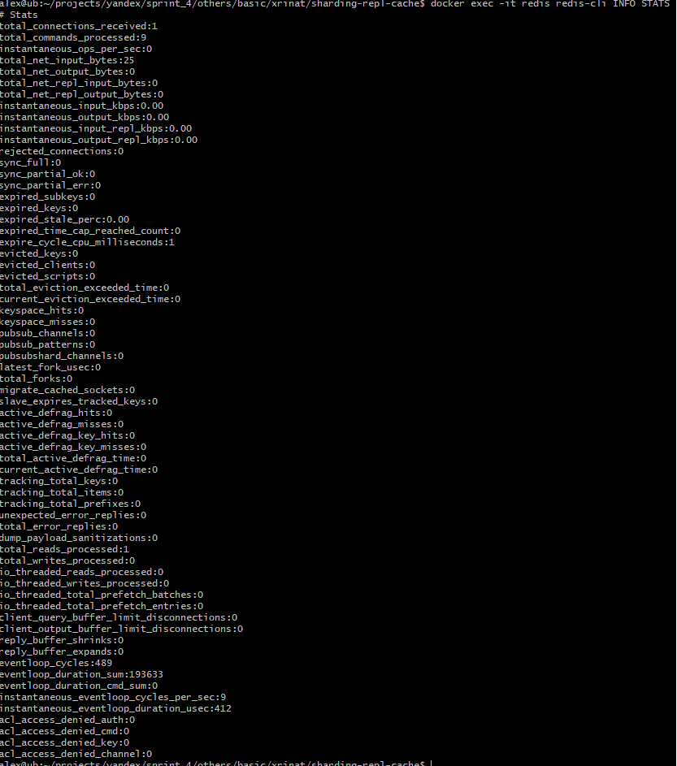
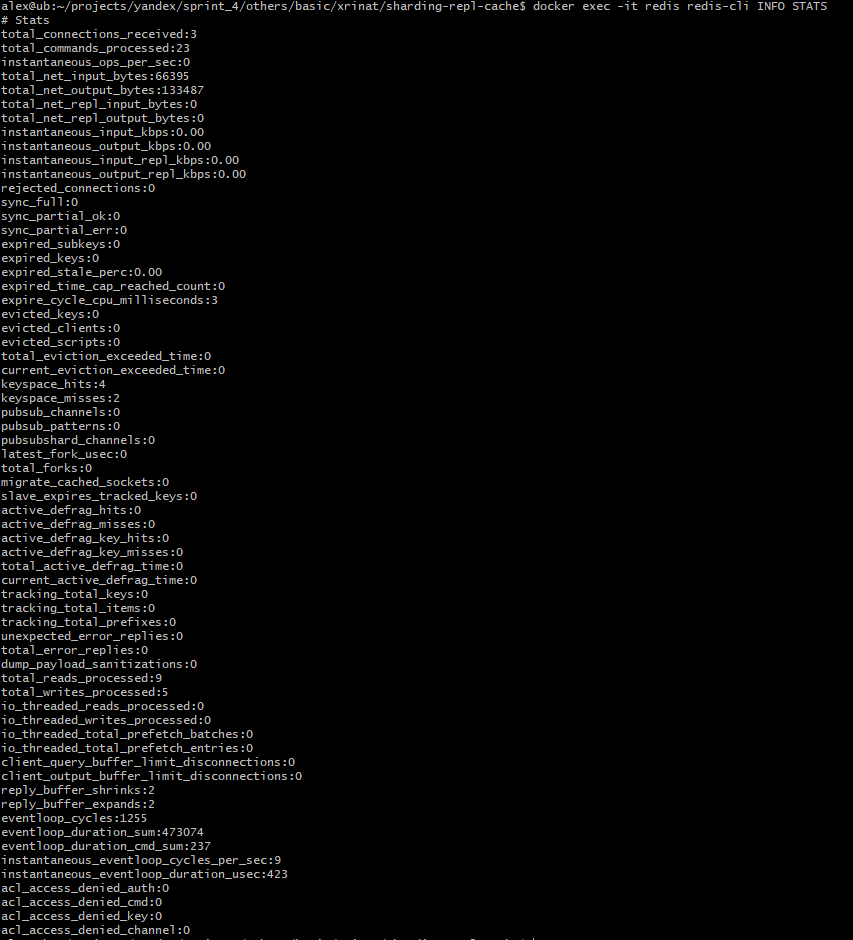

# pymongo-api

## Как запустить

1. В .env указать абсолютный путь до конфига Redis (REDIS_CONFIG)

1. Переходим в папку ./Task 1-2-3-4-5-6/sharding-repl-cache
```shell
cd ./Task 1-2-3-4-5-6/sharding-repl-cache
```

3. апускаем mongodb, redis и приложение

```shell
docker compose up -d
```

4. Инициализируем и заполняем redis и mongodb данными   

```shell
./scripts/init.sh
```

## Как проверить

Откройте в браузере http://localhost:8080/helloDoc/users - Второй и последующие вызовы должны выполнятся <100мс.  
Можно наблюдать, что кэш включен в pymongo-api  
  

## Проверка на уровне Redis:  
docker exec -it redis redis-cli INFO STATS  

Статистика redis до вызова запроса http://localhost:8080/helloDoc/users в приложении:  
  

Статистика redis после вызова запроса http://localhost:8080/helloDoc/users в приложении:  
  

