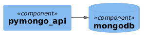

# Введение 

## О компании

В этой проектной работе вас ждёт кейс онлайн-магазина «Мобильный мир», где можно купить аксессуары для смартфонов. Уже готов Proof of Concept (PоC) для сайта, чей бэкенд состоит из нескольких микросервисов.

## Текущее решение

В преддверии «чёрной пятницы» магазин запустил классную рекламу, которая привлекла много покупателей. Из-за этого в какой-то момент сайт перестал справляться с потоком пользователей и упал на несколько часов.

Чтобы узнать причины сбоя, команда разработчиков провела исследование. Выяснилось, что один из микросервисов — API, который работает с базой данных, — не справился с нагрузкой, что повлияло на работу всего сайта. Забились очереди обработки заказов, таски начали отваливаться по тайм-ауту. В итоге магазин потерял много заказов и упустил прибыль.

На схеме изображён один инстанс приложения и одна нода MongoDB:



Скоро «Мобильный мир» собирается провести ещё одну распродажу. Чтобы подготовиться к ней, команда разработчиков планирует повысить отказоустойчивость приложения и ключевой базы данных, увеличить пропускные способности инфраструктуры и оптимизировать компонент системы, который отвечает за взаимодействие с MongoDB.

Эту задачу вы и будете решать в проектной работе.

## Подготовьтесь к работе

В репозитории на GitHub лежит проект на Docker Compose. Он разворачивает текущий стенд микросервисов сайта: pymongo-api и single инстанс MongoDB.

Сделайте форк репозитория в свой личный репозиторий на GitHub и запустите проект локально для проверки:
- Инструкция для запуска описана в README.md.
- Приложение будет доступно на порте 8080.
- Документацию API можно посмотреть на эндпоинте /docs.

Обратите внимание: чтобы запустить проект на Docker Compose, нужно минимум 2 CPU и 4 Гб ОЗУ.

## Задание 1. Планирование

Ваша задача — реализовать шардирование, репликацию и кеширование. Чтобы это сделать, распланируйте изменения.

[Вот шаблон схемы исходного приложения](diagram.puml). Скачайте его.

На основе этого шаблона вам нужно создать схему итогового решения. Рекомендуем работать над ней в несколько этапов. Вот первые три шага:

- Подготовьте первый вариант схемы. Изобразите, как вы будете использовать шардирование в MongoDB, чтобы повысить производительность. Двух шардов будет достаточно.
- Составьте второй вариант схемы. Изобразите, как будет реализована репликация MongoDB для повышения отказоустойчивости. Чтобы это сделать, скопируйте первый вариант схемы и доработайте его, чтобы для каждого шарда была настроена репликация. На этом этапе у каждого шарда должно быть по три реплики.
- И наконец, на третьем варианте схемы изобразите вашу реализацию кеширования, чтобы повысить производительность ещё больше. Чтобы это сделать, скопируйте второй вариант схемы и добавьте инстанс Redis для кеширования запросов приложения к MongoDB.

Обратите внимание, что к концу проектной работы у вас всего получится пять схем, потому что в заданиях 5 и 6 тоже нужно будет поработать со схемой. Однако ревьюер будет проверять только итоговый вариант. На нём должны быть все изменения, которые вы внесёте в проект в процессе решения проектной работы целиком. Мы рекомендуем делать отдельные схемы для каждого этапа, чтобы было проще контролировать изменения.

### На что будет смотреть ревьюер:

- На схемах укажите инстанс приложения и все инстансы инфраструктурных сервисов, а также их типы (pymongo-api, configSrv, redis, shard1-1, shard1-2 и т. п.). Имена сервисов можно взять из примеров, которые описаны в уроках.
- Выделите группы репликации.
- Отобразите стрелками сетевые взаимодействия между сервисами.

## Задание 2. Шардирование

- Скопируйте исходную директорию с приложением и compose.yaml под новым именем mongo-sharding.
- В файле compose.yaml измените имя проекта на name: mongo-sharding.
- Модифицируйте compose.yaml таким образом, чтобы реализовать первый вариант схемы. За основу можете взять пример из урока про шардирование.
- В директории с проектом создайте файл README.md. Опишите там шаги для инициализации шардирования в MongoDB.

С помощью этого shell-скрипта можно автоматизировать выполнение команд на инстансах MongoDB:

```bash
docker compose exec -T <service-name> mongosh --port <mongo port> --quiet <<EOF
<mongosh commands here>
EOF
```

Например, так выглядят команды для отображения количества документов в БД `somedb` инстанса `shard1`:

```bash
docker compose exec -T shard1 mongosh --port 27018 --quiet <<EOF
use somedb
db.helloDoc.countDocuments()
EOF
```

> **Примечание:** Номера портов по умолчанию для различных типов инстансов MongoDB можно узнать [в документации](https://www.mongodb.com/docs/manual/reference/default-mongodb-port/).

- Назовите БД `somedb`, а коллекцию — `helloDoc`.

### На что будет смотреть ревьюер:

- Проект запускается.
- Настройка по инструкции в README.md выполняется без ошибок.
- Приложение работает и показывает общее количество документов в базе (≥ 1000), а также количество документов в каждом из шардов.

## Задание 3. Репликация

- Скопируйте директорию с проектом mongo-sharding под новым именем mongo-sharding-repl.
- В файле compose.yaml измените имя проекта на name: mongo-sharding-repl.
- Модифицируйте compose.yaml таким образом, чтобы реализовать второй вариант схемы. За основу можете взять пример из урока про репликацию и кеширование.
- В директории с проектом создайте файл README.md. Опишите там шаги, которые нужно выполнить, чтобы настроить репликацию для каждого шарда в MongoDB.
- Не забывайте, что с помощью shell-скрипта можно автоматизировать выполнение команд.

### На что будет смотреть ревьюер:

- Проект запускается.
- Настройка по инструкции в README.md выполняется без ошибок.
- Приложение работает и показывает общее количество документов в базе (≥ 1000), количество документов в каждом из шардов, а также количество реплик.

## Задание 4. Кеширование

- Скопируйте директорию с проектом mongo-sharding-repl под новым именем sharding-repl-cache.
- В файле compose.yaml измените имя проекта на name: sharding-repl-cache.
- Модифицируйте compose.yaml таким образом, чтобы реализовать третий вариант схемы. В качестве ориентира можете использовать пример из урока про кеширование.
- Чтобы включить кеширование в приложении, добавьте переменную окружения:

```
REDIS_URL: "redis://<redis-service-name>:6379"
```

Вместо `<redis-service-name>` напишите имя сервиса redis.

- В приложении кеширование доступно для эндпоинта `/<collection_name>/users`. Проверьте скорость выполнения повторных запросов — она должна увеличиться.

### На что будет смотреть ревьюер:

- Проект запускается.
- Настройка по инструкции в README.md выполняется без ошибок.
- Приложение работает и показывает общее количество документов в базе (≥ 1000), количество документов в каждом из шардов и количество реплик.
- Второй и последующие вызовы эндпоинта `/<collection_name>/users` выполняются <100мс.

## Как отправить работу

### Перед отправкой проверьте, что:

- В `README.md` проекта есть инструкция, как запустить проект. Обычно достаточно команды запуска проекта `docker compose up -d` и команд для инициализации, которые вы создадите в задании 2.
- В репозитории лежат:
  - Итоговая схема архитектуры системы.
  - Проект `sharding-repl-cache` с файлом `compose.yaml`.
  - Файл `README.md` с инструкцией по запуску и инициализации проекта.

Когда всё будет готово, вставьте ссылку на пул-реквест GitHub во вкладке «Ревью» в уроке «Сдача проектной работы».

## Задание 5. Service Discovery и балансировка с API Gateway

Сейчас у онлайн-магазина «Мобильный мир» развёрнут только один инстанс приложения. Это может вызвать простои в случае перезапуска сайта. Например, при обновлении. К тому же один инстанс может просто не справиться с нагрузкой. Чтобы решить эту проблему, нужно реализовать горизонтальное масштабирование сайта.

Если запустить несколько инстансов, то непонятно, на какой из них подавать трафик. Для распределения трафика используйте API Gateway.

Ещё нужно как-то сообщать API Gateway об изменении количества инстансов. Например, что нужно добавить новые инстансы в балансировку или убрать оттуда удалённые. Чтобы решить эту проблему, используйте Hashicorp Consul для Service Discovery.

Составьте четвёртый вариант схемы, на котором вы покажете реализацию горизонтального масштабирования сайта. Для этого скопируйте третий вариант, добавив на схему API Gateway для балансировки и Consul для Service Discovery.

### На что будет смотреть ревьюер:

На схеме нужно отобразить несколько инстансов приложения, инстансы Consul и API Gateway, а также сетевое взаимодействие между ними с помощью стрелок.

## Задание 6. CDN

Чтобы ускорить доставку статического контента пользователям в разных регионах, нужно использовать CDN. Составьте пятый вариант схемы, на котором вы это реализуете. Для этого скопируйте предыдущий (четвёртый) вариант, добавив на него сервис CDN в нескольких регионах.

### На что будет смотреть ревьюер:

- На схеме нужно отобразить CDN, взаимодействие пользователей из разных регионов с CDN, а также показать, откуда CDN будет получать статический контент онлайн-магазина.

## Критерии приёмки

### Перед отправкой проверьте, что:

- В `README.md` проекта есть инструкция, как запустить проект. Обычно достаточно команды запуска проекта `docker compose up -d` и выполнения скрипта. Либо — команды инициализации и наполнения MongoDB.
- Вы используете docker-образ приложения `kazhem/pymongo_api:1.0.0`.
- Все сервисы запускаются. Проверить статус сервисов можно командой `docker compose ps`.
- Приложение открывается в браузере и отображает JSON с информацией о MongoDB.
- Приложение отображает информацию о MongoDB и статус использования кеша в формате JSON.